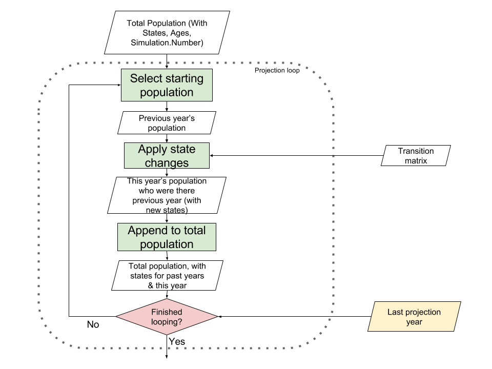

# Introduction to witan.send

## Background

This model allows English local authorities to compare the costs and demand for SEND (special educational needs and disabilities) services for different future scenarios. The demand is for statements/EHC plans only and does not include SEN support.

A stochastic Markov chain approach is used to assign a state to each individual eligible for SEND at each time step of the model.

## Model structure

The main steps of the model (represented on the flowchart below) are:

* the first steps to prepare the data going into the loop,
* the loop itself (one round of the loop per year of projection), and
* the last step of associating the cost to the projections once the loop is finished.

## Model steps

### Data preparation steps

#### Steps to prepare the two datasets

* “**Get historic population**”:
The historic population for 0 to 25 years old and the historic SEND population inputs are transformed and associated to generate one historic dataset of 0 to 25 years old of both SEND and non-SEND with one year per individual and per simulation.

* “**Account for population change**”:
The historic population for 0 to 25 years old and population projections for this LA are used to calculate the differences between the expected aged-on population and the projections for the following year and age group. These differences are an estimation for new non-SEND individuals added to the population due to new arrivants in the LA and also accounts for new births.

The outputs for both those steps are then joined to create the “Total Population”.
This dataset has one row per individual and per simulation and contains different SEND people and non-SEND people. It contains SEND historical data plus non-SEND data for the years of the projection.

#### Step to prepare the transition matrix

The main specificity when using a Markov chain approach is to define a structure that holds the probability for an individual from a particular group to transition to another group.
This structure is called a transition matrix.
The stochasticity is reflected by the use of a random number to select the transition state.

To try an alternative scenario the user enters an age (see 'age' user parameter on the diagram) and a percentage (see 'multiplier' user parameter on the diagram) to multiply the SEND joiners by for that particular age group. The default transition matrix is then adjusted to create a new transition matrix.
The adjusted transition matrix is then used within the loop.

*Note 1*: At the moment only the probabilities for SEND joiners can be adjusted automatically.

*Note 2*: Currently the 'multiplier' expects a number between 0 and 1 to be used to multiply the default probability. For example `1.0` is 100% of the default value, and `0.2` is 20% of the default value (so an 80% reduction).

### Inside the loop

* The **starting population is selected** from the “Total Population” by year (starting with the last year of historical data and incremented by one at each round of the loop)

* The **next year population is determined** from the **probabilities of the transition matrix** and the population numbers of the starting population.

* This new population is then **appended to the “Total population”**.

* If the loop isn’t finished **we go back at the start** where the new population plus the new joiners become the starting population (after being selected by year from the “Total population”). Otherwise **we exit the loop**.

### After the loop

* **Group individuals (by age, need and placement type)** and calculate averages and confidence intervals over simulations.

* In parallel upload the cost profile (cost per SEND need/placement combination, per individual).

* **Multiply the projected averages** for SEND individuals by the cost for a specific SEND need/placement.
